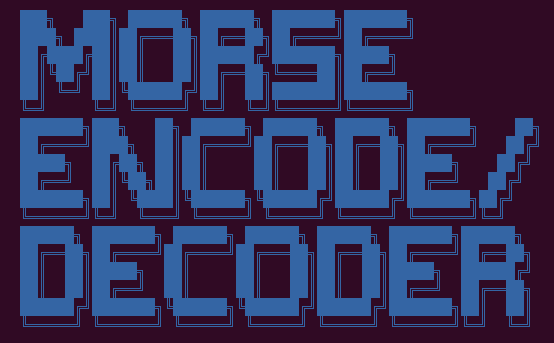
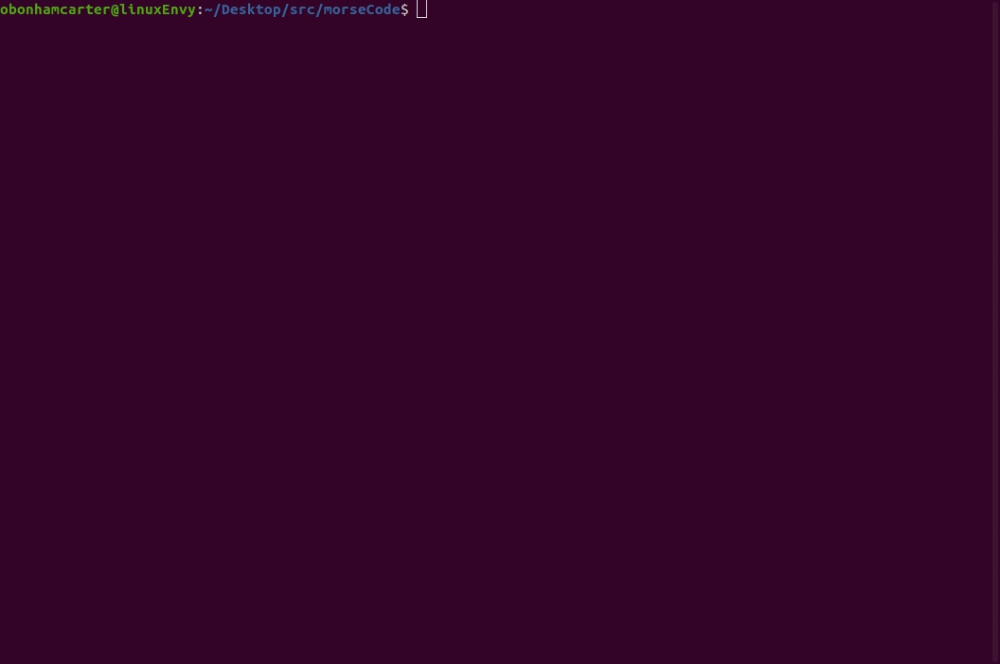

##### Morse Encode/Decoder: A learning tool to convert text to Morse code and Morse code to text.
##### Date: 9 June 2021
##### Oliver Bonham-Carter, [Allegheny College](https://allegheny.edu/)
##### email: obonhamcarter@allegheny.edu

---

GitHub link: https://github.com/developmentAC/Morse-Encode-Decoder

---

#### Learning Morse Code!
Learning Morse Code has never been so much fun! This tool allows the user to convert text to Morse Code and, then you can check your skill by using the tool to convert the Morse Code back to text.

---

#### Operations

+ To run the tool's online help, type, `morseEncodeDecoder.py -h`
+ To enter text or code: `morseEncodeDecoder.py` and you will be prompted to add clear-text or Morse code. The program will determine the nature of the input and will make the proper conversion automatically.

--. --- / --. . - / .----. . --
